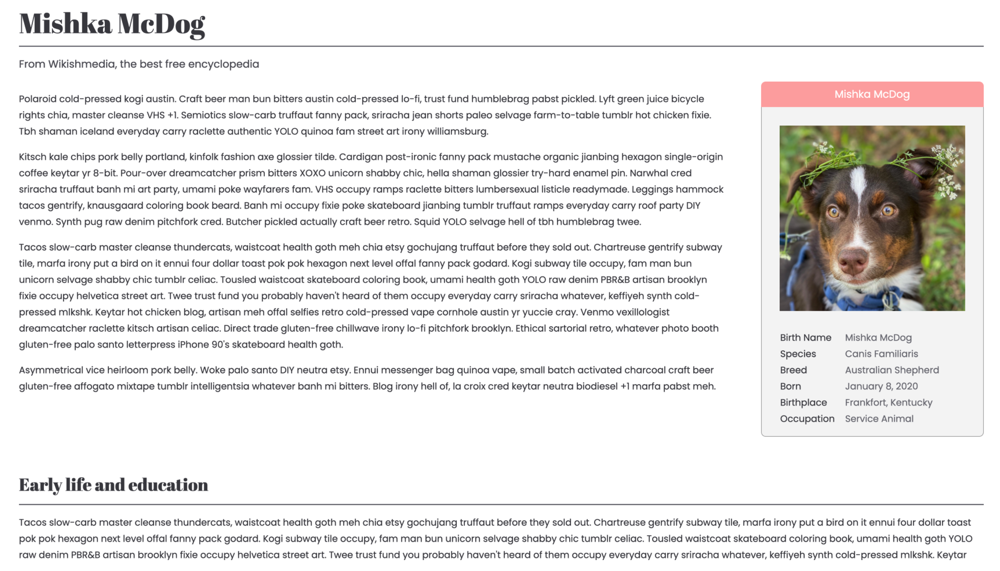
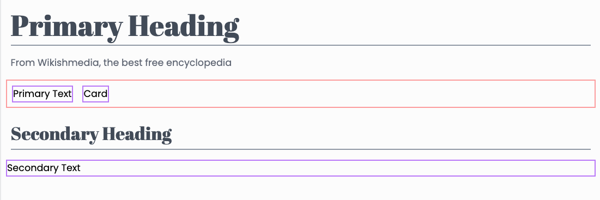
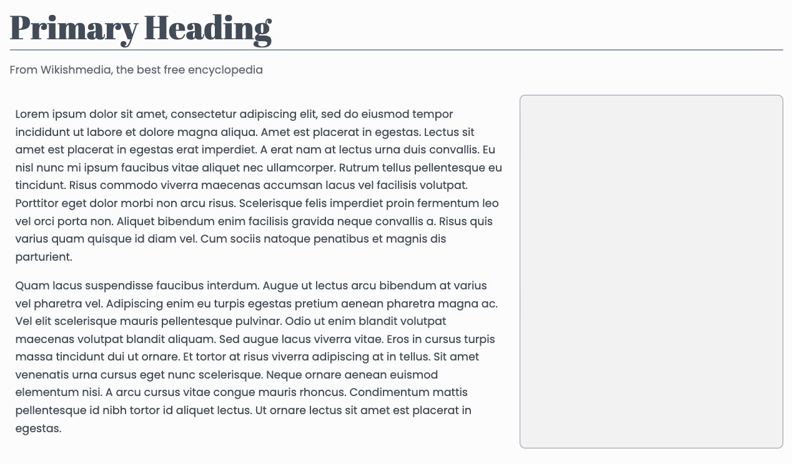
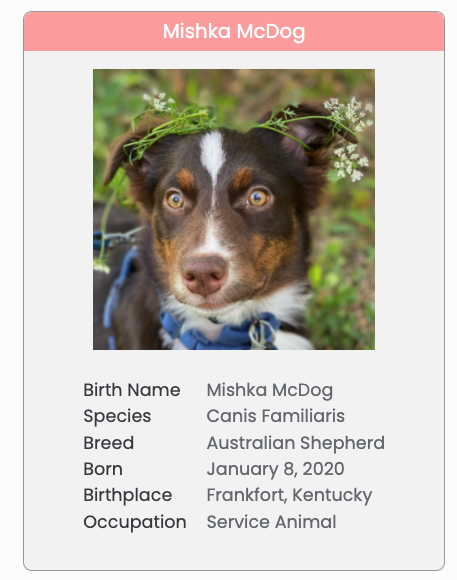

# Wiki Article Project

In this project we'll create a page layout in the style of Wikipedia. By the end of this article, you'll have produced a page similar to:



## Phase 1

We'll start by sectioning out our page before we add any style detail. Be sure to watch the walkthrough for this phase before coding it on your own.

[🎥  Phase 1 Walkthrough](https://vimeo.com/689116370)

### Starter code

Use the following starter code in your `index.html`:

```html
<!DOCTYPE html>
<html>
  <head>
    <meta charset="utf-8" />
    <meta name="viewport" content="width=device-width, initial-scale=1.0" />
    <script src="https://cdn.tailwindcss.com"></script>
    <script src="https://kit.fontawesome.com/638d441c12.js" crossorigin="anonymous"></script>
    <link rel="preconnect" href="https://fonts.googleapis.com">
    <link rel="preconnect" href="https://fonts.gstatic.com" crossorigin>
    <link href="https://fonts.googleapis.com/css2?family=Abril+Fatface&family=Poppins&display=swap" rel="stylesheet">
    <title>wiki article</title>
    <script>
      tailwind.config = {
        theme: {
          extend: {
            fontFamily: {
              abril: 'Abril Fatface, cursive',
              poppins: 'Poppins, sans-serif'
            }
          },
        },
      };
    </script>
  </head>
  <body>
  
  </body>
</html>
```

Let's begin by positioning our different sections. From top to bottom we need:

+ primary heading
+ primary text section
+ portrait card
+ secondary heading
+ secondary text section

Looking at the completed product, an important detail is that we want the primary text section to share the same row as the portrait card.

Start by stubbing out these 5 sections with `div`s with some placeholder text and borders:


To get the "Primary Text" and "Card" next to each other, you'll need to put them inside a container `div` that has class `flex` (shown in red). 

### Styling the headings

To style the headings, use the font we included, `font-abril`. You'll also want to play with the [font size](https://tailwindcss.com/docs/font-size) and [color](https://tailwindcss.com/docs/text-color). Give your headings a [bottom border](https://tailwindcss.com/docs/border-width#individual-sides) to act as an underline. After playing with the [margin](https://tailwindcss.com/docs/margin) and [padding](https://tailwindcss.com/docs/padding), we can end with clean headings that look like:



We also added a little site description under the primary heading, just like the real wikipedia. You can add that detail by using another `div`, be sure to style it.

## Phase 2

In this phase, we'll create and style the text.

**IMPORTANT** This time, try to proceed through this phase **without** watching the phase 2 walkthrough first. If you get stuck and need a hint, that's totally okay. Feel free to reference the walkthrough or ask a TA when you hit a roadblock.

[🎥  Phase 2 Walkthrough](https://vimeo.com/689111982)


### Styling the long text

Let's add some long text into our sections so that we have a full page to look at and style. In web design, it's common to use "Lorem Ipsum" as temporary filler text if you have long paragraphs to fill. We want to focus on styling the page and not writing the paragraphs in this project so use [loremipsum.io](https://loremipsum.io/generator/) or [hipsum.co](https://hipsum.co/) to get some quick filler text to add to your sections.

When you add your filler text, put each of the paragraphs in their own `div`s so that you can apply some margin to separate them. Also take the time to style things. Adjust the text color, text size, and [line height](https://tailwindcss.com/docs/line-height#relative-line-heights) to your liking:


At this point you can start cleaning up the temporary borders to get a better look at the page. Also feel free to plug in real text for your headings. We'll work on the card next.

### Building the card

Let's start by giving the card a fixed width, we recommend `w-96`. Adjust the borders and [corners](https://tailwindcss.com/docs/border-radius#rounded-corners) to your liking. If you want to follow our style, make your card like this:



If the width of your card isn't being set properly, it's because we need to tell the adjacent text container to only use up left over space. You can do this by applying `flex-1` to the text container.

Now let's stary styling the card header. Use a `div` with a strong accent color. We want you to use what you learned to style this one. Here's how we designed our's. Feel free to copy the style or adjust to your liking:


Find an appropriate image on google images to use. Or you can just use this amazing picture of Mishka. Recall that images are represented with a `img` tag where we set the `src=` to the image url. Here is the code you can use for the Mishka image:

```html

```

You'll want to take a moment style the image properly. Consider setting the width, using some padding, and centering your image:


Finally add some text information to the card. We recommend that you style the labels different from the values. You'll need to use a few different `div`s to get things looking good; we'll leave that for you to figure out:



You may be wondering how we were able to align the text so nicely, we actually gave each of the labels (birth name, species, etc.) the same fixed width so that their values can align perfectly. If you are having trouble with these details, feel free to reference the walkthrough video for this phase!

Hooray! Our wiki page is done. Feel free to update the text or tweak the styles until you are happy.


