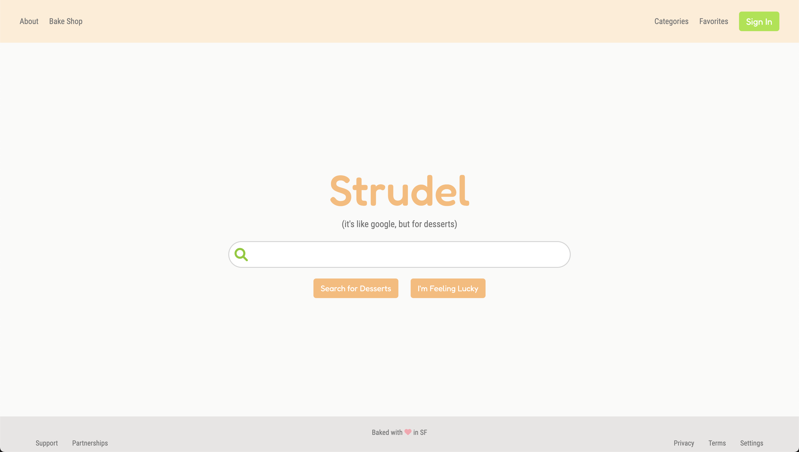
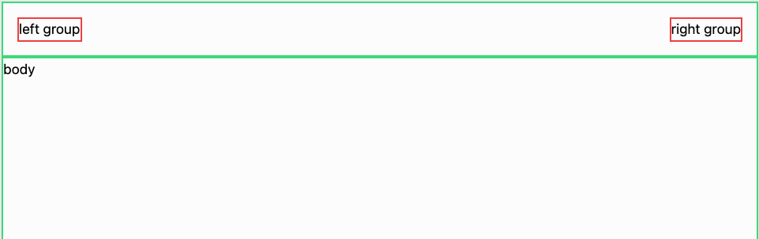
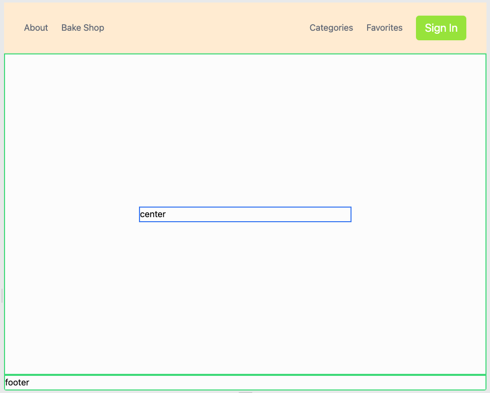
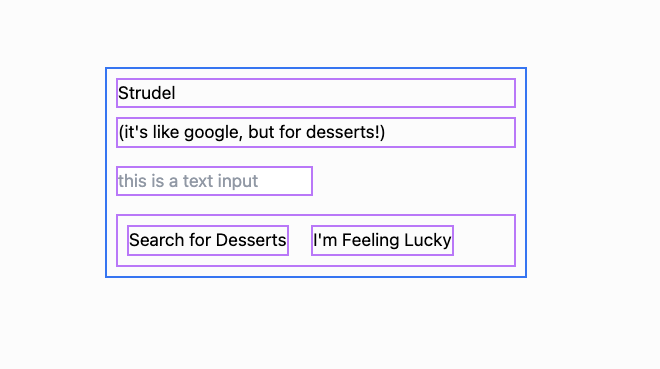
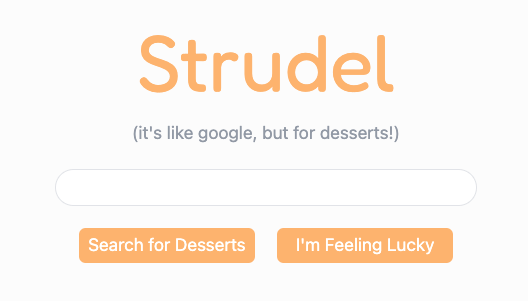
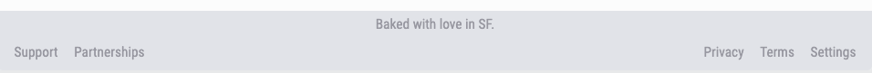

# Search Page Project

In this project we'll build a page inspired by the classic Google layout. By the end of this
project, you'll build a page similar to this:



## Phase 1

In this initial phase, we'll begin the three sections and focus on styling the header.

**This time, try to code up this phase on your own first by following the text instructions. Then
use the video walkthrough if you get stuck:**

[🎥 Phase 1 Walkthrough](https://vimeo.com/702074407)

### Starter Code

Begin with the following starter code:

```html
<!DOCTYPE html>
<html>
  <head>
    <meta charset="utf-8" />
    <meta name="viewport" content="width=device-width, initial-scale=1.0" />
    <script src="https://cdn.tailwindcss.com"></script>
    <script src="https://kit.fontawesome.com/638d441c12.js" crossorigin="anonymous"></script>
    <link rel="preconnect" href="https://fonts.googleapis.com" />
    <link rel="preconnect" href="https://fonts.gstatic.com" crossorigin />
    <link
      href="https://fonts.googleapis.com/css2?family=Fredoka:wght@400;500&family=Roboto+Condensed&display=swap"
      rel="stylesheet"
    />
    <title>search page</title>
    <script>
      tailwind.config = {
        theme: {
          extend: {
            fontFamily: {
              fredoka: "Fredoka, sans-serif",
              roboto: "Roboto condensed, serif",
            },
          },
        },
      };
    </script>
  </head>
  <body>
    Let's build a search page layout
  </body>
</html>
```

Let's begin by adding a full height `div` to present the full page. Be sure to use `h-screen` and
apply a [background color](https://tailwindcss.com/docs/background-color). We chose `bg-stone-50`.
Within this background `div`, create three more `div`s to represent the header, body, and footer.
Use some temporary borders and text so you can see them.

We'll want to make the center `div` larger than the header and footer. Because we want this center
`div` to be larger relative to it's siblings, we should make the parent background a `flex flex-col`
and use `flex-1` on the center `div`:


> Check In: Make sure your layout looks like this before moving on. Call over a TA for help if you
> need.

### Building the header

Let's add some content to the header. Look at completed product at the top of this reading, you'll
notice that there are two groups of content in the header.

To the left we have:

- About
- Bake Shop

To the right we have:

- Categories
- Favorites
- Sign In

Create two `div`s in the header to act as the container for these two groups. By applying
`flex justify-between` to the header, we'll maximize the space between the two groups. Like usual,
use temporary borders and text so you can see what you are doing. Use some
[padding](https://tailwindcss.com/docs/padding) on the header div, for some tasteful spacing:



Add the content to the left and right groups. You can use `div`s to hold each of the text fragments.
However, be sure to make "Sign In" a button. You'll neeed to make the left and right group divs have
`flex` so they hold their content horizontally.

As you design the content within the header, we'll leave the details to you. You'll want to play
with the [margin](https://tailwindcss.com/docs/margin) between the content as well as style your
button fully. Feel free to use `text-roboto` or `text-fredoka` for some different fonts. If the
content within your left and right groups is not on the center line, use `items-center` on the group
divs. After playing with the style and colors, we end up with:


Notice the detail within the button! We used rounded corners, larger font, generous padding, and
contrasting colors. These details make it a button that you want to click. Can you make your's look
similar?

## Phase 2

In this phase, we'll focus on adding the content to the body section.

**This time, try to code up this phase on your own first by following the text instructions. Then
use the video walkthrough if you get stuck:**

[🎥 Phase 2 Walkthrough](https://vimeo.com/702443280)

### Basic content layout

Start by centering a new `div` within the body div, this new div will act as the container for all
the content. Give the child a temporary border, width, and text. Recall that to center a child, we
can give the parent `flex justify-center items-center`:



There are a few different elements we'll need to stub out:

- title
- description
- text input
- two buttons

Just focus on the placement of these elements for now. Use what you've learned so far to establish a
layout like this:



### Adding style to the body

In the image above, we applied a purple border to all elements that we used. The most critical
detail is to make sure that the two buttons are on the same row. We accomplished this by using `div`
to contain both buttons.

Now it's time for you to add all the details to this skeleton. As you add the styles, start from the
title and work your way down. Be sure to preview your site often to make sure everything is OK.
Using what you've learned so far, style content similar to this:



Wow what a difference right? Believe it or not we were able to get this look by just manipulating
the basics that you've already learned. Here are some tips:

- use `font-fredoka` for the title
- use `rounded-full` to make the search bar very round, also make it wide with `w-96`
- use light grays for the description text and search bar border

We'll leave it to you to eyeball the rest. Feel free to use different colors especially.

## Phase 3

Finally let's wrap up with the footer.

**This time, try to code up this phase on your own first by following the text instructions. Then
use the video walkthrough if you get stuck:**

[🎥 Phase 2 Walkthrough](https://vimeo.com/702443079)

### Styling the footer

Looking at the finished product at the top of this reading, the footer contains 3 main groups. A
centered group above, and a groups to the left and to the right below. Stub these out using
temporary borders!


Notice that since the left and right sections are in the same row we had to put them inside of a
parent `div` with `flex justify-between`.

Now use all your style skills to make it look good! With a little bit of work you should be able to
make nice and aethestic like:



Awesome. And there you have it. You may have noticed that the final product image at the top of this
reading has two icons. A magnifying glass in the search bar and a heart in the footer. Browse icons
on [font awesome](https://fontawesome.com/search?s=solid%2Cbrands) and incorporate these into your
page. Feel free to add icons elsewhere too. If you are having trouble with using the icons, review
the walkthrough for this phase to see how we utilize them.
