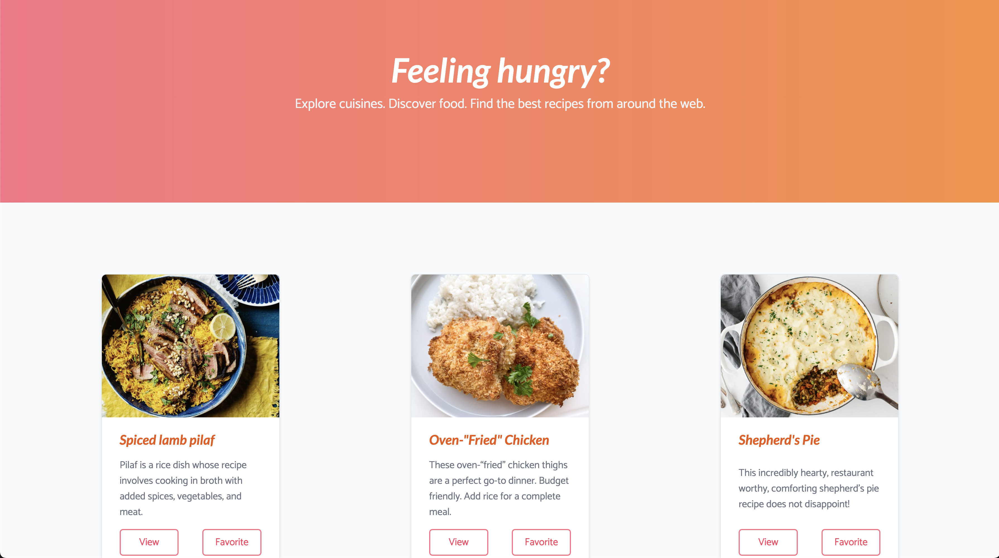
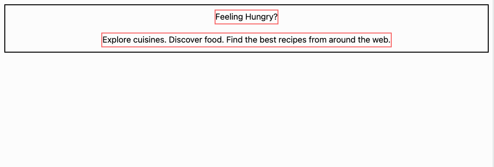
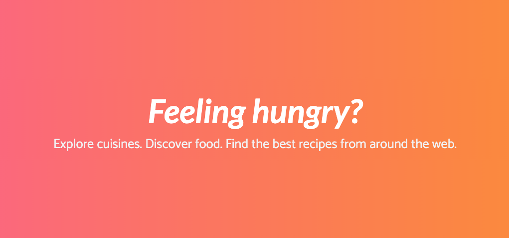
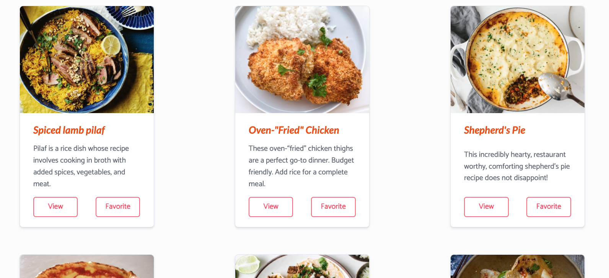

# Recipes List Project

In this project, we'll build a recipe list page. By the end of this project we'll have a page that
looks like this:



## Phase 1

In this first phase we'll create a stylish header.

### Starter code

Begin with the following starter `index.html` that includes some fonts to use:

```html
<!DOCTYPE html>
<html>
  <head>
    <meta charset="utf-8" />
    <meta name="viewport" content="width=device-width, initial-scale=1.0" />
    <script src="https://cdn.tailwindcss.com"></script>
    <script src="https://kit.fontawesome.com/638d441c12.js" crossorigin="anonymous"></script>
    <link rel="preconnect" href="https://fonts.googleapis.com" />
    <link rel="preconnect" href="https://fonts.gstatic.com" crossorigin />
    <link
      href="https://fonts.googleapis.com/css2?family=Catamaran&family=Lato:ital,wght@0,400;0,700;1,400;1,700&display=swap"
      rel="stylesheet"
    />
    <title>recipe list</title>
    <script>
      tailwind.config = {
        theme: {
          extend: {
            fontFamily: {
              lato: "Lato, sans-serif",
              catamaran: "Catamaran, sans-serif",
            },
          },
        },
      };
    </script>
  </head>
  <body>
    Let's build a recipes list page.
  </body>
</html>
```

**Try to code up this phase on your own first by following the text instructions. Then
use the video walkthrough if you get stuck:**

[🎥 Phase 1 Walkthrough](https://vimeo.com/702676273)

Let's start simple by stubbing out the header. This should be straightforward. We just roughly three
`div`s:

- the header container that will hold everything
- the main text "Feeling hungry?"
- the secondary text "Explore cuisines..."

Create the header skeleton add use some temporary borders and a little margin to make sure
everything is good. Center everything nicely. Like usual, you'll probably want to make the container
`flex flex-col items-center` to do this:



### Styling the header

Now that the skeleton is in place, let's fully style the header. Use some generous
[margin](https://tailwindcss.com/docs/margin) or [padding](https://tailwindcss.com/docs/padding).
Use `font-catamaran` for the main text and `font-lato italic` for the secondary text. Adjust all the sizing
and colors to your liking. We played with the
[font weight](https://tailwindcss.com/docs/font-weight) and
[font style](https://tailwindcss.com/docs/font-style) in our design too:



We made the background a gradient from pink to orange using the class
`bg-gradient-to-r from-rose-400 to-orange-400`, you can choose your own colors to blend.

## Phase 2

In this phase, we'll style a single card.

**Try to code up this phase on your own first by following the text instructions. Then
use the video walkthrough if you get stuck:**

[🎥 Phase 2 Walkthrough](https://vimeo.com/702675434)

### Styling a card

You've made many cards in the course already! We want you to build the card on your own. Use what
you learned to style a card like this:


If you get stuck, feel free to reference the walkthrough for this phase. For the image, choose one
of you favorite foods on Google images. We recommend you choose a large enough image that is
"landscape", that means it has a larger width than its height. This will help the image fit nicely
in the entire top part of the card. Use a height an `object-cover` to crop the image to fit the
height. For example we used this `img` code for our card:

```html

```

As you style this card, take your time to get all of the fine details.

### Adding many cards

We'll want to display many cards. Add more cards and be sure to put them in a `flex` container so
you can show all of them. You'll want to space your cards nicely. If your cards are all squished
together on a single row, be sure to add `flex wrap` to ensure that new cards wrap to the next line
when the space is full. Use different images:



If you want to use the same images as us, use the following:

```
https://img.delicious.com.au/tkw2IWA6/w759-h506-cfill/del/2021/07/moroccan-spiced-lamb-pilaf-155009-2.jpg

https://imagesvc.meredithcorp.io/v3/mm/image?q=60&c=sc&poi=face&url=https%3A%2F%2Fimages.media-allrecipes.com%2Fuserphotos%2F8459611.jpg

https://i2.wp.com/www.downshiftology.com/wp-content/uploads/2019/12/Shepherds-Pie-8.jpg

https://upload.wikimedia.org/wikipedia/commons/a/a3/Eq_it-na_pizza-margherita_sep2005_sml.jpg

https://i2.wp.com/www.downshiftology.com/wp-content/uploads/2018/04/Carne-Asada-Tacos-main-3.jpg

https://images.food52.com/hHk7_GsaqAmLbkLthbsngX71wlc=/750x500/2706eae4-f100-426b-9f2f-e8b01e2c195f--Vegetable-Dumpling-F52Post.jpg
```

And there we have a nice recipes list layout! Good job.
