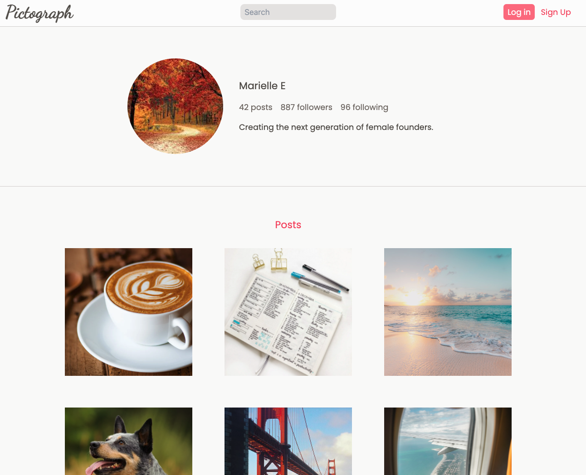
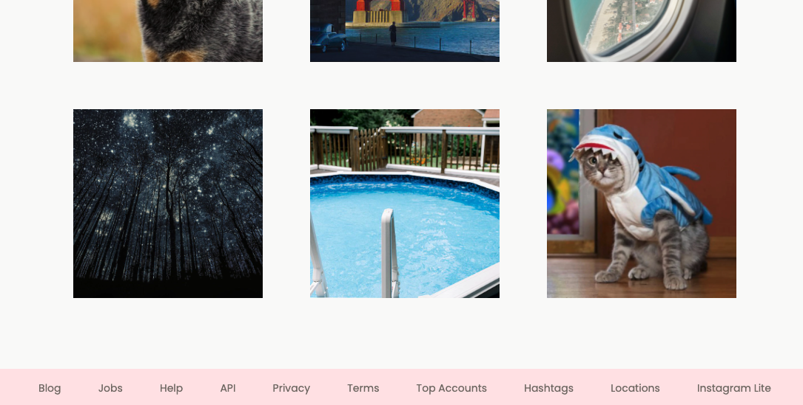

# Gallery Project

In this project, we'll create a layout for displaying a gallery of images. The layout is heavily
inspired by [Instagram](https://www.instagram.com/htm.elle/). The final product for our page looks
like this:





Create a identical layout! You may change only the image, colors, text, and icons.

You've already used all the tools you need to create this design. We want **you** to drive this. For
this project, try to code this one up and only use the video walkthrough if you get stuck!

Choose your own colors from [tailwindcss](https://tailwindcss.com/docs/customizing-colors) and icons
from [font-awesome](https://fontawesome.com/).

## Starter code

Use this starter code. We've given you two fonts, `font-dancing` and `font-poppins`.

```html
<!DOCTYPE html>
<html>
  <head>
    <meta charset="utf-8" />
    <meta name="viewport" content="width=device-width, initial-scale=1.0" />
    <script src="https://cdn.tailwindcss.com"></script>
    <script src="https://kit.fontawesome.com/638d441c12.js" crossorigin="anonymous"></script>
    <link rel="preconnect" href="https://fonts.googleapis.com" />
    <link rel="preconnect" href="https://fonts.gstatic.com" crossorigin />
    <link
      href="https://fonts.googleapis.com/css2?family=Dancing+Script&family=Poppins&display=swap"
      rel="stylesheet"
    />

    <title>recipe list</title>
    <script>
      tailwind.config = {
        theme: {
          extend: {
            fontFamily: {
              dancing: "Dancing Script, cursive",
              poppins: "Poppins, sans-serif",
            },
          },
        },
      };
    </script>
  </head>
  <body>
    Let's build a gallery!
  </body>
</html>
```

If you need help figuring out this layout or you finished your code, watch the walkthrough:

+ [🎥 Gallery Project Walkthrough 1](https://vimeo.com/708047413)
+ [🎥 Gallery Project Walkthrough 2](https://vimeo.com/708046821)
+ [🎥 Gallery Project Walkthrough 3](https://vimeo.com/708047763)