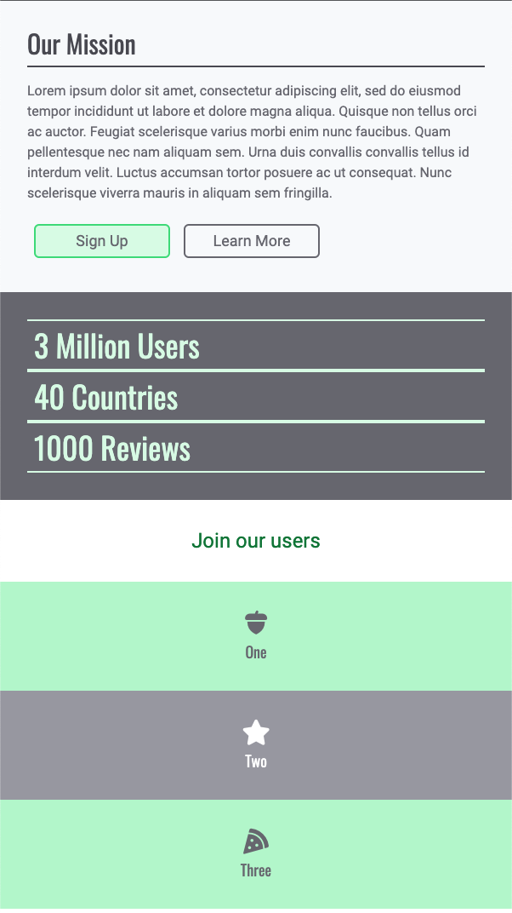
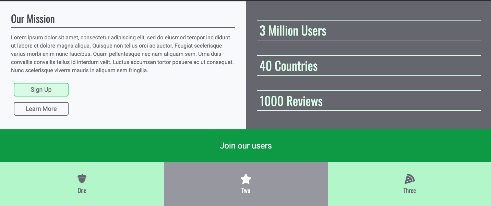

# Mobile Project 1

In this project, we'll explore how to create layouts that look good on both small screens and large
screen sizes. These days, devices come in all shapes and sizes from small phones, to larger tablets
or desktops. Having a site that looks responsive depending on the screen size is critical in this
day and age!

Our final product will look something like this on mobile screen sizes:



But the same product will look like this on desktop screen sizes:



Notice how the sections of the page are rearranged to accomodate for the width of the screen. The
cool part is that we will accomplish this by using single `index.html` page!

Since this our first time implementing a responsive layout, this project will be a code-along. **This
means that you'll be watching the video walkthrough and coding things up right as we do!** We'll
introduce and explain the tricks needed to create a responsive design.

As you code-along with use, feel free to choose your own colors from
[tailwindcss](https://tailwindcss.com/docs/customizing-colors) and icons from
[font-awesome](https://fontawesome.com/).

## Starter code

Use this starter code. We've given you two fonts, `font-oswald` and `font-roboto`.

```html
<!DOCTYPE html>
<html>
  <head>
    <meta charset="utf-8" />
    <meta name="viewport" content="width=device-width, initial-scale=1.0" />
    <script src="https://cdn.tailwindcss.com"></script>
    <script src="https://kit.fontawesome.com/638d441c12.js" crossorigin="anonymous"></script>
    <link rel="preconnect" href="https://fonts.googleapis.com" />
    <link rel="preconnect" href="https://fonts.gstatic.com" crossorigin />
    <link
      href="https://fonts.googleapis.com/css2?family=Oswald&family=Roboto&display=swap"
      rel="stylesheet"
    />
    <title>mobile project 1</title>
    <script>
      tailwind.config = {
        theme: {
          extend: {
            fontFamily: {
              oswald: "Oswald, sans-serif",
              roboto: "Roboto, sans-serif",
            },
          },
        },
      };
    </script>
  </head>
  <body>
    let's build our first mobile layout
  </body>
</html>
```

## Code along

Code along with us:

- [🎥 Mobile Project 1 Walkthrough 1](https://vimeo.com/708449937)
- [🎥 Mobile Project 1 Walkthrough 2](https://vimeo.com/708449147)
