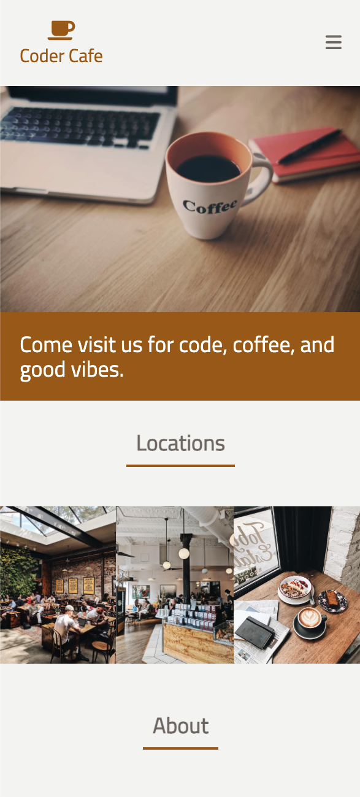
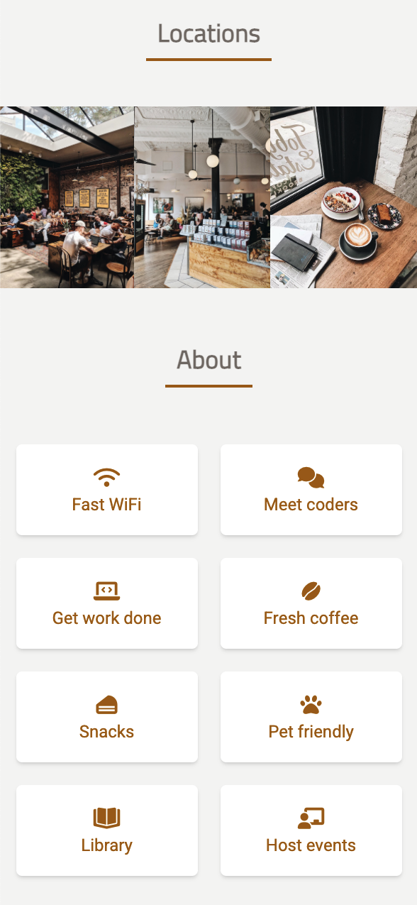
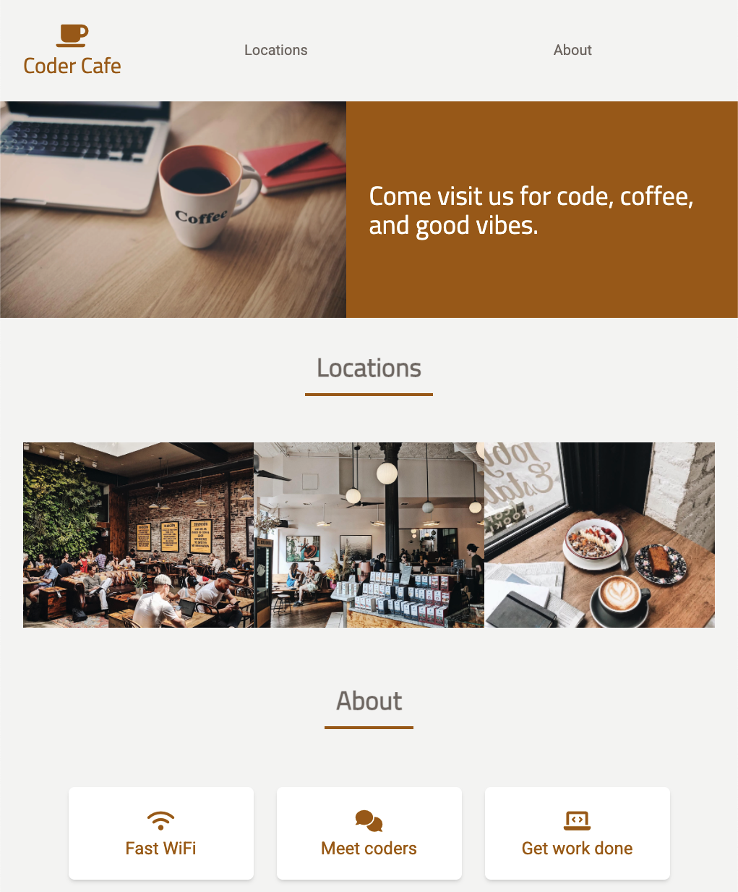
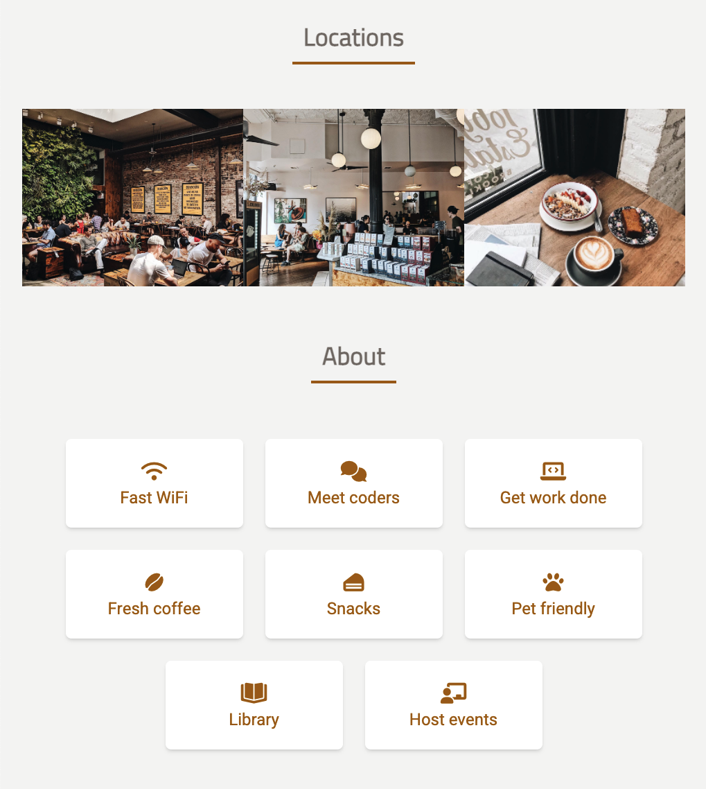

# Mobile Project 2

In this project, you'll continue practicing responsive layouts. This time though we want you to
drive this project and use only use the video walkthroughs when you get stuck or finish the code.
Our final product will look something like this on mobile screen sizes:

 



But the same product will look like this on desktop screen sizes:





Notice how the sections of the page are rearranged to accomodate for the width of the screen. The
cool part is that we will accomplish this by using single `index.html` page!

As you code-along with use, feel free to choose your own colors from
[tailwindcss](https://tailwindcss.com/docs/customizing-colors) and icons from
[font-awesome](https://fontawesome.com/).

## Starter code

Use this starter code. We've given you two fonts, `font-web` and `font-heebo`.

```html
<!DOCTYPE html>
<html>
  <head>
    <meta charset="utf-8" />
    <meta name="viewport" content="width=device-width, initial-scale=1.0" />
    <script src="https://cdn.tailwindcss.com"></script>
    <script src="https://kit.fontawesome.com/638d441c12.js" crossorigin="anonymous"></script>
    <link rel="preconnect" href="https://fonts.googleapis.com" />
    <link rel="preconnect" href="https://fonts.gstatic.com" crossorigin />
    <link
      href="https://fonts.googleapis.com/css2?family=Heebo&family=Titillium+Web&display=swap"
      rel="stylesheet"
    />
    <title>mobile project 2</title>
    <script>
      tailwind.config = {
        theme: {
          extend: {
            fontFamily: {
              web: "Titillium Web, sans-serif",
              heebo: "Heebo, sans-serif",
            },
          },
        },
      };
    </script>
  </head>
  <body>
    Let's create another mobile layout
  </body>
</html>
```

## Video Walkthroughs

Be sure to give the code a shot on your own first beforing watching these wakthroughs! It's
improtant that we try to be self-sufficient as programmers as we move into week 3, since you'll be
creating your very own layouts soon.

- [🎥 Mobile Project 2 Walkthrough 1]()
- [🎥 Mobile Project 2 Walkthrough 2]()
- [🎥 Mobile Project 2 Walkthrough 3]()
