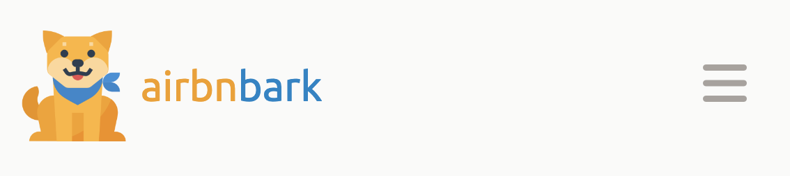
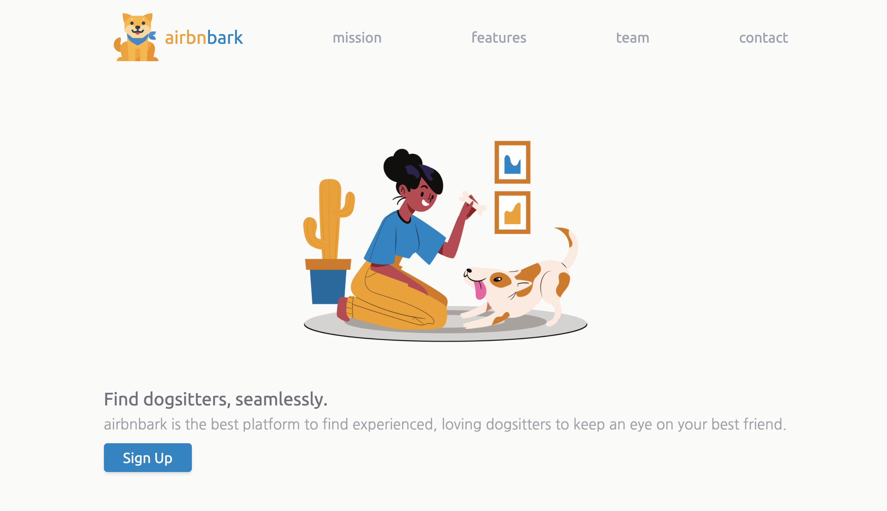
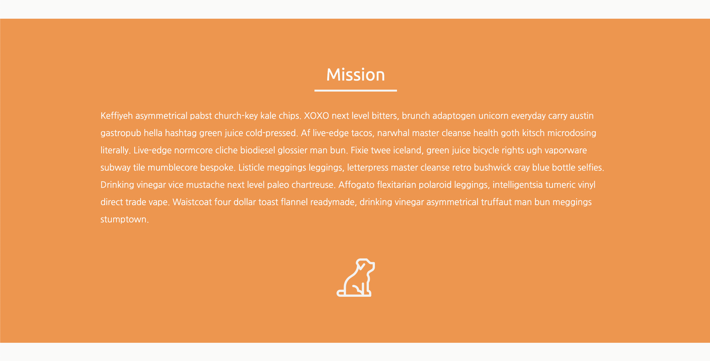

# Week 3 Day 1

Welcome to capstone project week! Over the past two weeks you've learned how to make amazing layouts
using HTML and CSS. Now it's time for you to create your very own startup website!

You won't have any hard instructions to do this. Your goal is design and implement a website that
you are proud of. Feel free to reference the different layouts you made in weeks 1 and 2 if you need
inspiration. Also, check out your favorite websites to borrow designs from. Alvin's favorites are
Instagram, AirBnb, and Twitter.

Get creative! Your startup website can be fictional so just have fun with it. Alvin will be making
"AirbnBark", a website where you can find dogsitters.

## Required sections

Your website must have the following sections:

- Header
- Hero
- Mission
- Features
- Team
- Testimonials
- FAQ
- Footer
- Contact form

You'll have time to work on these sections during studio time this week.

## Starter code

```html
<!DOCTYPE html>
<html>
  <head>
    <meta charset="utf-8" />
    <meta name="viewport" content="width=device-width, initial-scale=1.0" />
    <script src="https://cdn.tailwindcss.com"></script>
    <script src="https://kit.fontawesome.com/638d441c12.js" crossorigin="anonymous"></script>
    <title>capstone project</title>
    <script>
      tailwind.config = {
        theme: {
          extend: {
            fontFamily: {

            },
          },
        },
      };
    </script>
  </head>
  <body>
  </body>
</html>
```

### Sections to work on today

Today you should make progress on the following sections and continue working on these sections for
homework

- Header
- Hero
- Mission

#### Header

The header should include:

- name and logo for your site
- navigation buttons for the sections of your site
- mobile responsiveness with a mobile specific menu icon

You can design the header however you like as long as you include the above requirements. Choose
some colors, icons, styles that you like! If you need some inspiration on designing a header, watch
Alvin create his header for Airbnbark. Remember, you can design your site differently if you like.

- [🎥 Airbnbark header walkthrough](https://vimeo.com/714787571)




#### Hero 

The hero section should include:

- a large image that relates to what service your site offers
- short text describing your site
- a button to sign up

If you need some inspiration on designing a hero, watch Alvin create his hero for Airbnbark.

- [🎥 Airbnbark hero walkthrough](https://vimeo.com/714787346)



#### Mission

The mission section should include long text describing the mission of your website. Be thoughtful with what text you use! Don't use placeholder text :).

If you need some inspiration on designing a mission section, watch Alvin create his mission for Airbnbark.

- [🎥 Airbnbark mission walkthrough](https://vimeo.com/714995016)

