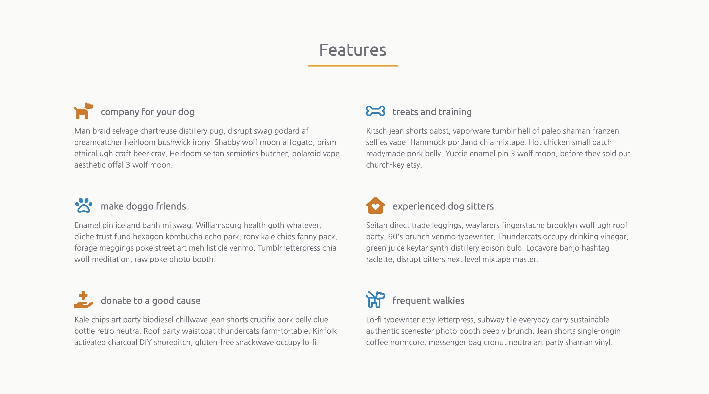
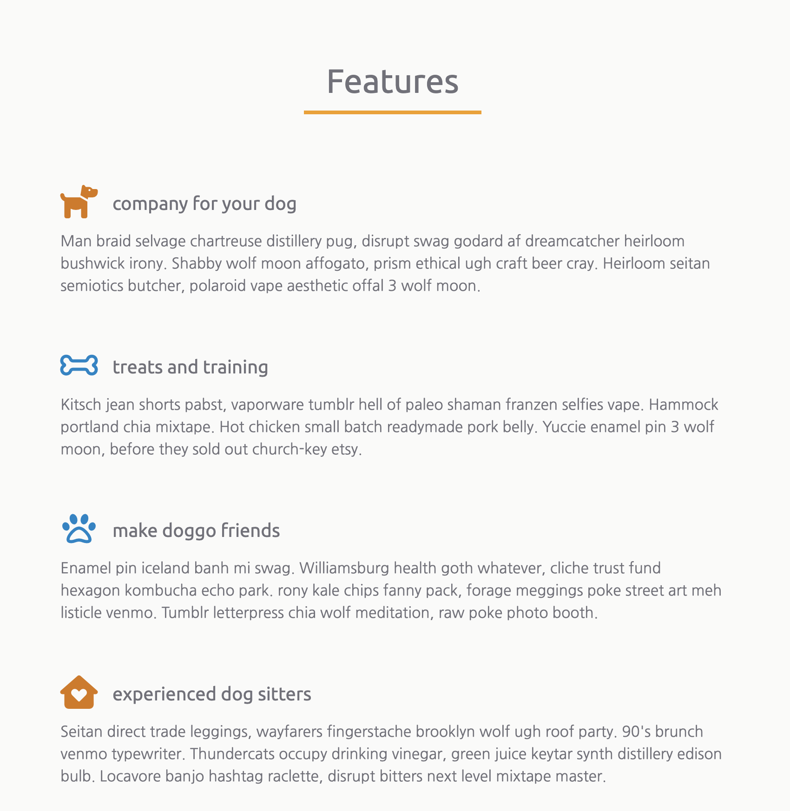
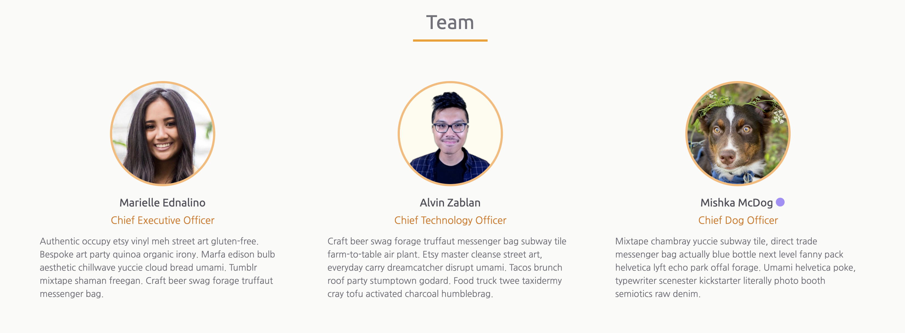
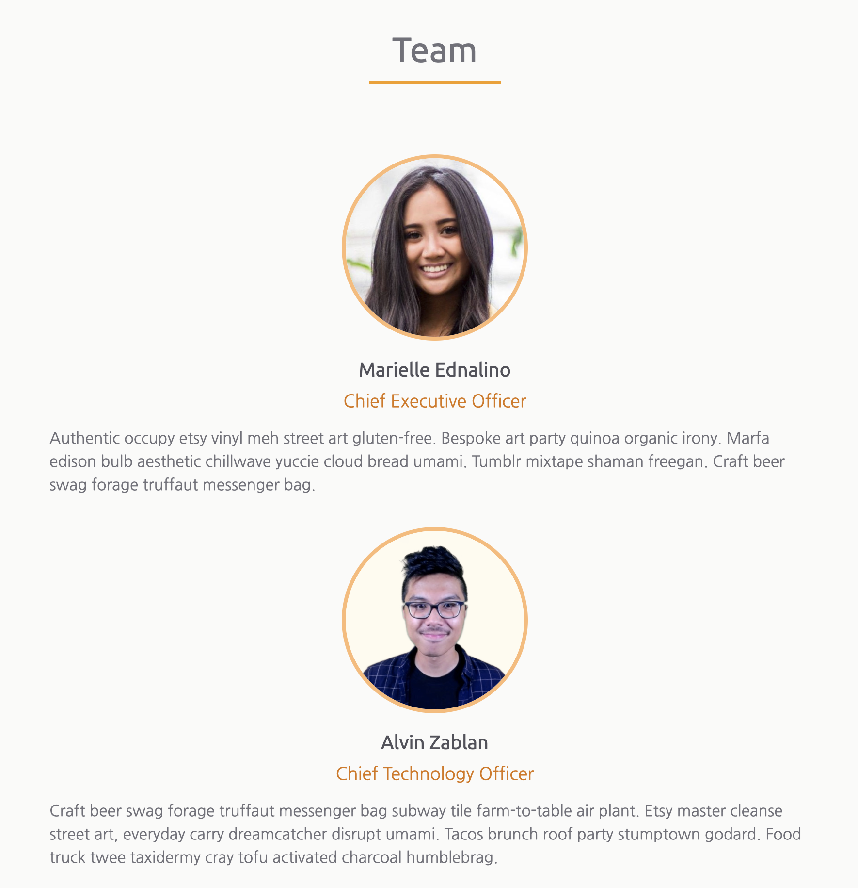

# Capstone Part 2

Today is the second day of capstone project work. If you have not finished the sections from
yesterday, feel free to take some time and continue to polish those. You should also start work on
two new sections.

### Sections to work on today

Today you should make progress on the following sections and continue working on these sections for
homework

- Features
- Team

#### Features

The features should include multiple pieces of text and icons describing what your startup offers.

If you need some inspiration on designing a features section, watch Alvin create his features for Airbnbark.

- [🎥 Airbnbark features walkthrough](https://vimeo.com/714995470)

#### Team

The team should include information about yourself! Be proud of your startup. You should include:
+ a portrait
+ your name
+ short bio/background text

If you need some inspiration on designing a team section, watch Alvin create his team for Airbnbark.

- [🎥 Airbnbark team walkthrough](https://vimeo.com/714994131)

