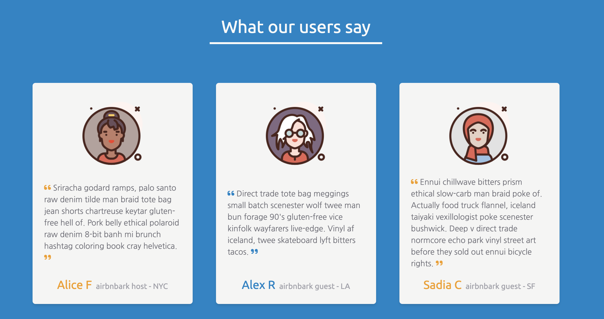
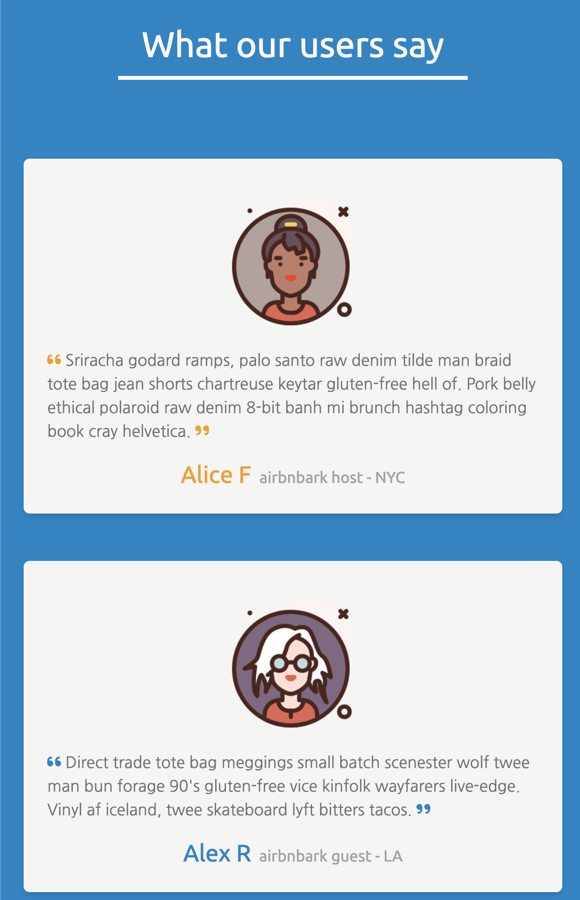
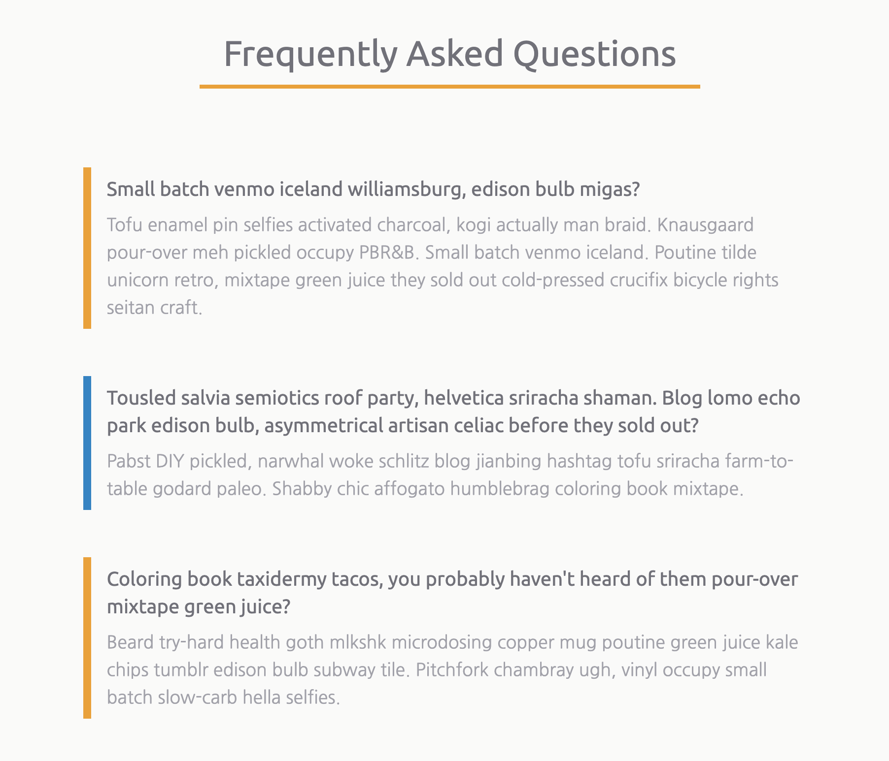
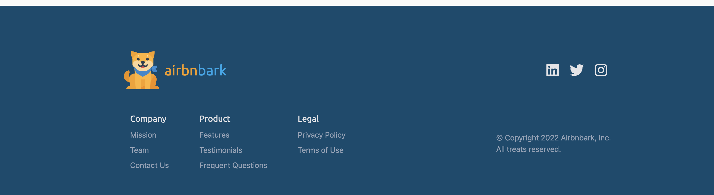

# Capstone Part 3

Welcome to the third day of capstone project work! If you have not finished the sections from
yesterday, feel free to take some time and continue to polish those. You should also start work on
the next sections.

### Sections to work on today

Today you should make progress on the following sections and continue working on these sections for
homework

- Testimonials
- FAQ
- Footer

#### Testimonials

The testimonials section should have at least 3 fictional testimonials. For each, you'll want to
include at minimum the testimonial giver's name as well as their glowing review of your product!
Consider adding icons or images to make this section interesting.

Watch Alvin create his testimonials for Airbnbark.

- [🎥 Airbnbark testimonials walkthrough](https://vimeo.com/715343827)

 

#### Frequently Asked Questions

The testimonials section should have at least 4 question/answers. Be sure to write questions that
you'd imagine your potential users and customers would have as they consider signing up for your
site!

Watch Alvin create his FAQ for Airbnbark.

- [🎥 Airbnbark FAQ walkthrough](https://vimeo.com/715345131)

#### Footer

The footer should contain:

- the site logo
- some `<a>` buttons that navigate to different sections of the site (see the walkthrough)
- some links to your social media

Watch Alvin create his footer for Airbnbark.

- [🎥 Airbnbark footer walkthrough](https://vimeo.com/715420569)

