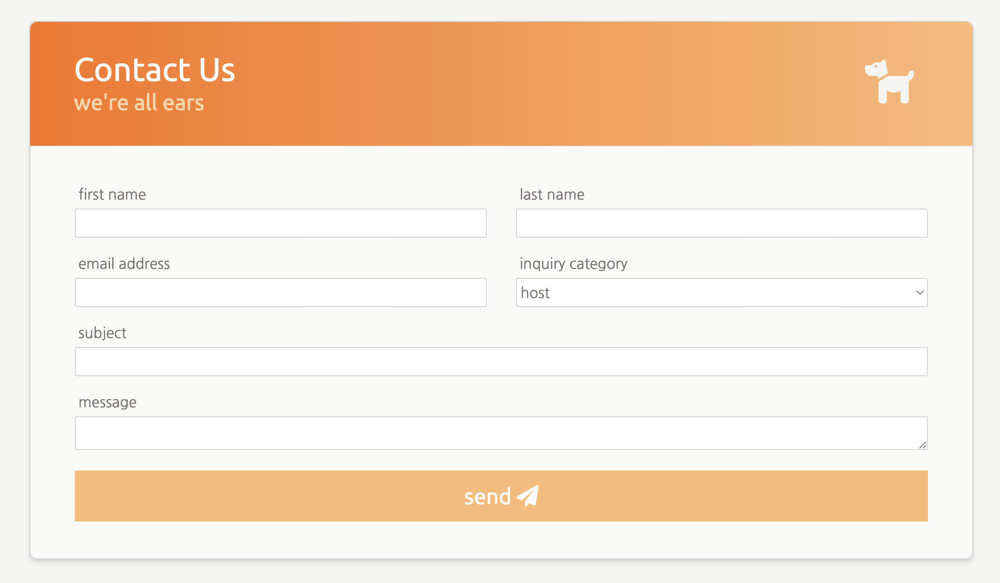

# Capstone Part 4

Today is the last day of capstone projects! The first thing we'll do today is learn how to deploy
your website so you can share it with other people easily. Once you deploy it, we'll resume project
work and you can work on the final section of your site.

## Deploying

Watch this walkthrough to learn how you can share your site with others!

[🎥 deploying your site](https://vimeo.com/715840868)

## Add a Contact Form section

The contact form is a form that a user could use to submit a question. Your form should at minimum
include:

- a name input
- a message input
- a submit button

You can feel free to add more inputs to your form. Watch Alvin create his form for Airbnbark.

- [🎥 Airbnbark form walkthrough](https://vimeo.com/715419537)

## Intro to JavaScript

Let's preview things to come! Exploring JavaScript fully is a topic for another time and place, but
let's introduce it here to get a glimpse at the endless possibilties.

- [🎥 Intro to JavaScript Lecture](https://vimeo.com/736301466)

Practice incorporating JavaScript into our existing projects.

- [🎥 Adding JS to Sign-In Form](https://vimeo.com/736301321)
- [🎥 Adding JS to Htmelle Times](https://vimeo.com/736302703)

Finally, try adding a small JavaScript feature to your startup website!
