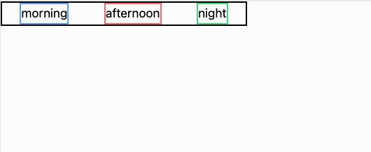
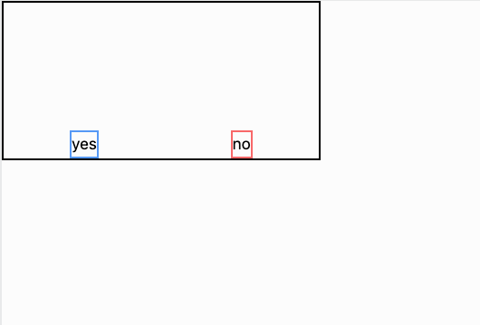
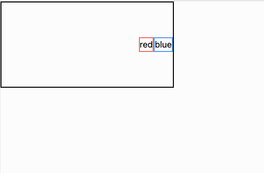
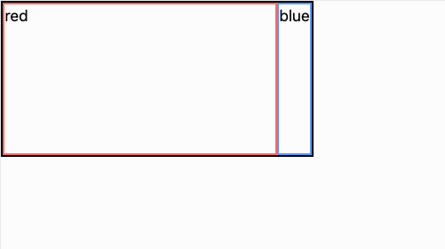
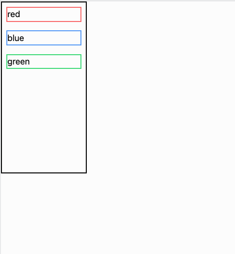

# Flex Exercises

Time to practice those flex properties! In the following exercises, we'll provide an image of a
layout that you must recreate using `flex` and the correct `justify-` and `items-` classes.

For each of the following exercises, create a new [replit](https://replit.com/~) using the following
starter code:

```html
<!DOCTYPE html>
<html>
  <head>
    <meta charset="utf-8" />
    <meta name="viewport" content="width=device-width, initial-scale=1.0" />
    <script src="https://cdn.tailwindcss.com"></script>
    <script src="https://kit.fontawesome.com/638d441c12.js" crossorigin="anonymous"></script>
    <script></script>
  </head>
  <body></body>
</html>
```

**Be sure to create a new replit for each exercise!** Small hints may be provided along with the
image for certain exercises. After every 4th exercise, you'll find a video walkthrough that you can
use if you get stuck and want a proper explanation of how to utilize `flex` to solve the exercises.

### Exercise 1

Create a replit and rebuild the following layout using flex!


A few tips:

- all borders have thickess `border-2`
- the border colors are `black`, `blue-400`, `red-400`
- the black div has width `w-80`

The color shades aren't super important for these exercises. For the rest of the exercises, just
eyeball for a similar color. We really want you to spend time thinking about the spacing for each
exercise. For example, in exercise 1, notice how the blue and red divs are touching the black border
on the left and right respectively.

### Exercise 2



### Exercise 3


The black div has width `w-80` like before but now also height `h-40`

### Exercise 4



### Walkthrough for exercises 1-4

- [🎥 Flex Exercises 1-4 Walkthrough]()

### Exercise 5


### Exercise 6


### Exercise 7



### Exercise 8



This one is special! How did we get the red div to be so large. This requires a new class. Check out
the walkthrough for how to accomplish this.

### Walkthrough for exercises 5-8

- [🎥 Flex Exercises 5-8 Walkthrough]()

### Exercise 9


Notice that these divs are stacked in a column. You'll need to use some sort of `flex-col`. The black div has `w-40` and `h-80`

### Exercise 10



This one is very similar to the previous except there is margin around each colored div.

### Exercise 11


### Exercise 12


### Walkthrough for exercises 9-12

- [🎥 Flex Exercises 9-12 Walkthrough]()

### Exercise 13


### Exercise 14


How did we get the green div to take up all the remaining space? We used a similar trick to what we
did in exercise 8. We'll leave it to you.

### Exercise 15


This last one is pretty complex! Notice that the large outer red div is a row while each blue div
is a column. Can you figure out the rest?

### Walkthrough for exercises 13-15

- [🎥 Flex Exercises 13-15 Walkthrough]()

## Wrap-Up

Nice work! Those were some tough exercises, but your practice will pay off. Learning flex will help
us create awesome layouts later in the course.
