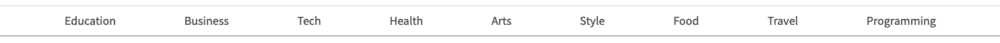

# Htmelle Times Project

In this project we'll clone the header from the classic [New York Times](https://www.nytimes.com/) webpage.

We'll work on building a page that looks like this:


You've been growing a lot over the past few days. We want **you** to drive this one. We'll break the layout into three sections, but it's up to you to use everything you learned to build this design.

Each part of the layout will still be covered by a video walkthrough, but the nitty gritty details are left to you.

## Phase 1 - the top

Use this starter code for the font's in this design:

```html
<!DOCTYPE html>
<html>
  <head>
    <meta charset="utf-8" />
    <meta name="viewport" content="width=device-width, initial-scale=1.0" />
    <script src="https://cdn.tailwindcss.com"></script>
    <script src="https://kit.fontawesome.com/638d441c12.js" crossorigin="anonymous"></script>
    <link rel="preconnect" href="https://fonts.googleapis.com">
    <link rel="preconnect" href="https://fonts.gstatic.com" crossorigin>
    <link href="https://fonts.googleapis.com/css2?family=Playfair+Display:ital,wght@0,400;0,500;0,600;1,500;1,600&family=Source+Sans+Pro:wght@400;600&display=swap" rel="stylesheet">
    <title>the htm.elle times</title>
    <script>
      tailwind.config = {
        theme: {
          extend: {
            fontFamily: {
              playfair: 'Playfair Display, serif',
              source: "Source Sans Pro, san-serif",
            }
          },
        },
      };
    </script>
  </head>
  <body>
    Let's build the Times header
  </body>
</html>
```

Your fonts are `text-playfair` and `text-source`. Use [fontawesome](https://fontawesome.com/) for the icons.

Create the top of the header so it looks like this:


### Phase 2 - the middle

Create the middle of the header so it looks like this:


### Phase 3 - the bottom

Create the bottom of the header so it looks like this:




Once you have stacked all three sections of the header, you are done. Nice! You should be proud of your work. Only a few days ago you wrote your first lines of html ;)

