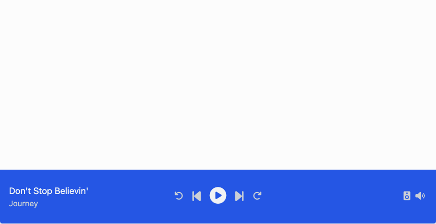
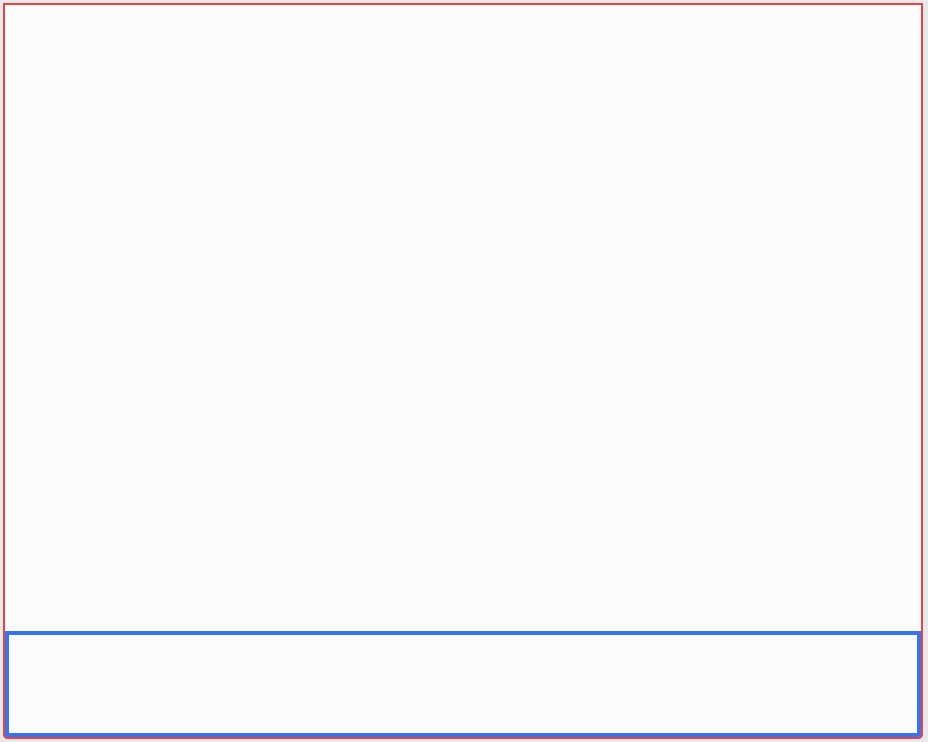
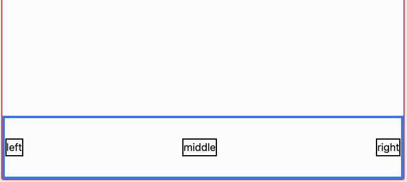
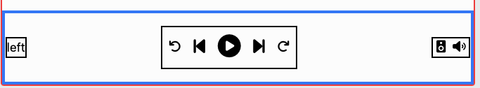

# Music Player Project

In this guided project, we'll be create a classic music player layout using everything we've learned
so far in the course. The final product will look something like this:



## Phase 1

Create a new HTML/CSS [replit](https://replit.com/~) for this project and replace the `index.html`
with the following starter code:

```html
<!DOCTYPE html>
<html>
  <head>
    <meta charset="utf-8" />
    <meta name="viewport" content="width=device-width, initial-scale=1.0" />
    <script src="https://cdn.tailwindcss.com"></script>
    <script src="https://kit.fontawesome.com/638d441c12.js" crossorigin="anonymous"></script>
    <title>music player layout</title>
    <script></script>
  </head>
  <body>
    Let's build a music player
  </body>
</html>
```

### Creating the skeleton

Let's start by creating the bar that will contain the music player. Start with two `div`s:



Use temporary borders so you can position the `div`s properly. Make the red `div` the height of the
entire screen with `h-screen`. Place the blue `div` inside of it and make the blue `div` a height of
`h-24` and full width using `w-full`.

In the image above, you'll notice that the blue div is at the bottom of the red container. You can
acomplish that by making the red a `flex` that has `items-end`. Recall that `items-end` places at
the bottom of a flex row, while `items-start` places at the top of a flex row.

### Stubbing the 3 sections

Within our player, we can split the content up into three sections. The left, middle, and right:



Stub out your 3 sections with temporary borders and text. Make your blue div a `flex` with
`justify-between`; this will push all the sections as far away as possible from each other. You'll
also want to make the blue div have `items-center` so that the 3 sections are vertically centered
like in the picture.

## Phase 2

In this phase, we'll add the style and detail into our player. Let's start to add the control icons
into middle section:


Search [fontawesome](https://fontawesome.com/search?q=play&s=solid%2Cbrands) for some appropriate
icons that you like. Feel free to choose different icons. If you want to use the same as ours, we
used the following:

```html
<i class="fa-solid fa-arrow-rotate-left"></i>
<i class="fa-solid fa-backward-step"></i>
<i class="fa-solid fa-circle-play"></i>
<i class="fa-solid fa-forward-step"></i>
<i class="fa-solid fa-arrow-rotate-right"></i>
```

Notice that icons are all centered vertically. You can accomplish that by making the middle
container a `flex items-center`. Use some [margin](https://tailwindcss.com/docs/margin) to space out
the icons. Feel free to adjust the size of your icons by applying a
[text-size](https://tailwindcss.com/docs/font-size#setting-the-font-size) to the icons. For example
we styled our play button using:

```html
<i class="m-2 text-3xl fa-solid fa-circle-play"></i>
```

After you have your middle icons complete, let's add two icons to the right section. Make the right
section a `flex` and be sure to apply some healthy margin:



The icons we chose for the speaker and volume were:

```html
<i class="fa-solid fa-speaker"></i> <i class="fa-solid fa-volume"></i>
```

Finally let's add the "current song" text to the left section. Make the left section a
`flex flex-col` because we want to stack the song title and artist vertically. Choose one of your
favorite songs:


Be sure to make separate `div`s for title and artist. This will allow them to stack.

## Phase 3

Now that all the content is in place. Let's add the final styles that will make this layout elegant!
Remove those temporary borders and choose a
[background-color](https://tailwindcss.com/docs/background-color) that you like. We chose
`bg-blue-600` for the background and `text-gray-300` for most of the text:


To add more variety, make your play button and song title a slightly different shade. We used
`text-gray-100` to brighten those elements. Adding padding on the player container (the solid blue
div in our images) will leave a tasteful gap for our left and right sections:


You may notice that we also shrunk the artist text with `text-sm`. Using small variations like that
help contrast details and draw user attention.

Depending on how long your song text is, the player middle section might not be perfectly in the
middle. Watch the walkthrough video to see how we clevery fix this detail!
