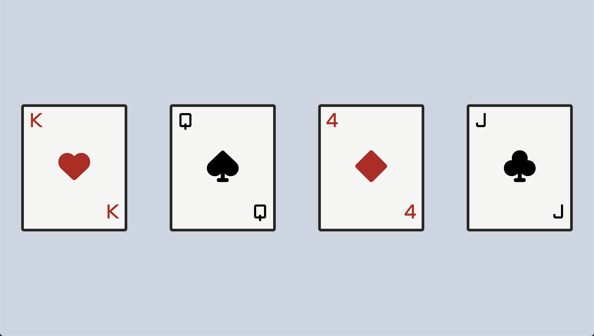

# Playing Card Project

In this project, we'll be creating playing cards. The finished product will look something like this:



## Phase 1

In this initial phase, we'll create a blank card.

### Starter code
Start by creating our document. Create `index.html` and paste the following starter code:

```html
<!DOCTYPE html>
<html>
  <head>
    <meta charset="utf-8" />
    <meta name="viewport" content="width=device-width, initial-scale=1.0" />
    <script src="https://cdn.tailwindcss.com"></script>
    <script src="https://kit.fontawesome.com/638d441c12.js" crossorigin="anonymous"></script>
    <link rel="preconnect" href="https://fonts.googleapis.com">
    <link rel="preconnect" href="https://fonts.gstatic.com" crossorigin>
		<link href="https://fonts.googleapis.com/css2?family=Aldrich&display=swap" rel="stylesheet">
    <title>playing cards</title>
    <script>
      tailwind.config = {
        theme: {
          extend: {
            fontFamily: {
              aldrich: 'Aldrich, sans-serif',
            }
          },
        },
      };
    </script>
  </head>
  <body>
		let's play cards
  </body>
</html>
```

Don't be overwhelmed by the starter code! The starter code includes configuration for the fonts and icons that we will use in this project. Like you'd expect, you'll be writing all your code in the `<body>` tags. Run the page to check that everything is set up. You should see `"let's play cards"` in the browser.

> Check In: Make sure you can see "let's play cards" before continuing. Ask a teaching assistant for help if you are stuck.


### Creating a blank card

Let's start simple. Our goal is to create a single rectangle in the center of the screen. Delete the `"let's play cards"` text in the body and create a `div`. Be sure to include the opening and closing tags for this `div`! This initial `div` will be the outer container that takes up the full screen, (the light blue shaded part in the [final product](#playing-card-project). You can use class `h-screen` to make the `div` take up the full height of the screen. Use a color class to give it background color. We used `bg-slate-200` for our background color, but you can use another [color that you like](https://tailwindcss.com/docs/customizing-colors#default-color-palette).

Now time to make a simple card. No tricks here. We just want a rectangle that is more tall than it is wide. Create a new `div` that will represent our card. You should place it within the background div that you made just previously. Set the width and height using classes `w-80` and `h-96`. If you want different dimensions of your card, feel free toi play aroudn with different[widths](https://tailwindcss.com/docs/width#fixed-widths) and [heights](https://tailwindcss.com/docs/height#fixed-heights). Finally, apply a background color to the card div, we used `bg-white`.

Give your card a thick, black border with `border-8` and choose a dark [border color](https://tailwindcss.com/docs/border-color). We used `border-stone-800`. Finally, let's round those corners with `rounded-lg`. If you want sharper corners, play with other [rounded styles](https://tailwindcss.com/docs/border-radius#rounded-corners).

## Phase 2

