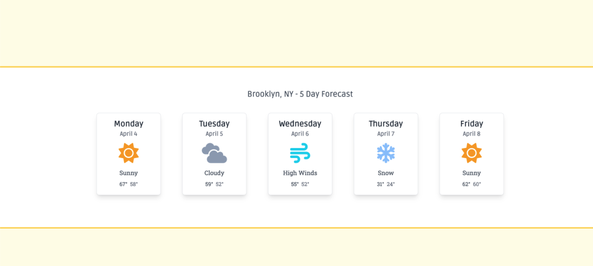
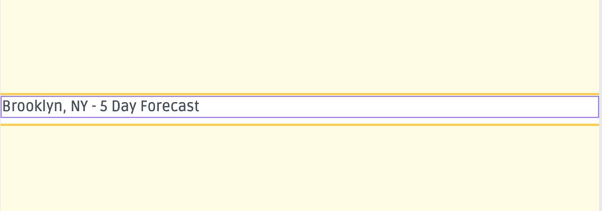
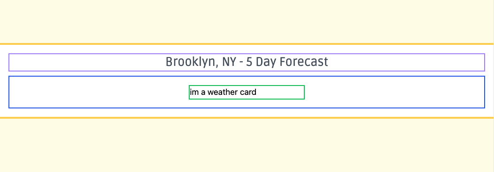
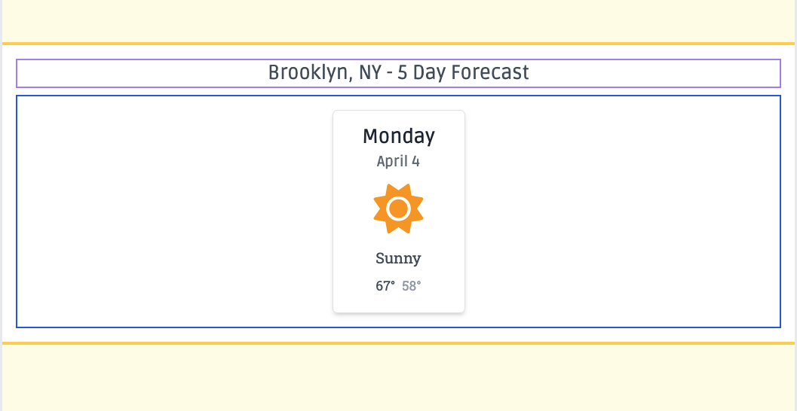

# Weather Forecast Project

In this project we'll build a view that displays a five-day weather forecast:



## Phase 1

In this initial phase, we'll lay down the background styles and start a single weather card. Watch the video walkthrough for this phase before coding this phase on your own.

[🎥 Phase 1 Walkthrough](https://vimeo.com/689056057)

### Starter code

Begin with the following starter code for your `index.html`. We've included some fonts and icons you can use in this starter code:

```html
<!DOCTYPE html>
<html>
  <head>
  <meta charset="utf-8" />
  <meta name="viewport" content="width=device-width, initial-scale=1.0" />
  <script src="https://cdn.tailwindcss.com"></script>
  <script src="https://kit.fontawesome.com/638d441c12.js" crossorigin="anonymous"></script>
  <link rel="preconnect" href="https://fonts.googleapis.com">
  <link rel="preconnect" href="https://fonts.gstatic.com" crossorigin>
  <link href="https://fonts.googleapis.com/css2?family=Roboto+Slab&family=Ruda:wght@400;500;700&display=swap" rel="stylesheet">
  <title>weather forecast</title>
  <script>
    tailwind.config = {
      theme: {
        extend: {
          fontFamily: {
            ruda: 'Ruda, sans-serif',
            roboto: 'Roboto Slab, serif'
          }
        },
      },
    };
  </script>
  </head>
  <body>
    Let's build a weather forecast
  </body>
</html>
```


Let's start by stubbing out a colored background `div` that takes up the full screen height. Like usual you can do this by specifying `h-screen`. Choose a [background color](https://tailwindcss.com/docs/background-color) you like; we chose `bg-yellow-50`. 

Create another `div` inside of background div. To center it within the background, add `flex items-center` to the parent. Place another `div` containing location text within the inner `div` for now. Add some [padding](https://tailwindcss.com/docs/padding) to the inner `div`. Take some time to adjust the text to your liking. We applied a temporary purple border to the location text for now:



You may notice that our centered `div` has a dark yellow border only on the top and bottom. We did that using `border-y-4 border-amber-300`.

### Creating the containers

Eventually we want to hold multiple weather cards. To account for this, we should create a new container `div` below the title. Give it a temporary border.

Add another `div` with `w-40` or similar as the first weather card in that container. After some basic centering, margin, and padding, we'll want to end up with a skeleton that looks like:



If you are having trouble centering things, recall that `flex` is our best friend :) .

> Check In: Make sure you have a skeleton that looks like ours before moving on. The colors can differ, but the overall layout of the boxes should be similar. Call over your friendly neighborhood TA for help if you need!

## Phase 2

In this phase, we'll work to add all of the content within a single card. Watch the video walkthrough for this phase before coding this phase on your own.

[🎥 Phase 2 Walkthrough](https://vimeo.com/689054923)

### Styling a weather card

Let's start styling the weather card. Throw down some `div`s within the card containing the different pieces of text we need. You'll want a div for each of:

+ day of the week
+ date
+ icon
+ description
+ high/low temperatures

Be sure to stack these elements vertically by giving the card `flex flex-col`. Let's use a subtle rounded border and shadow with `border border-neutral-200 shadow-md rounded-md`:


Looking good so far! We want you to add all the proper detail into the card on your own. Utilize `text-ruda` and `text-roboto` for different font styles. Play with the colors, margin, and padding until you end up with a design you like. Search [font awesome](https://fontawesome.com/search?q=weather) for an appropriate icon to use. After some work, you'll want to end up with something like:



Awesome! Now we can just duplicate the weather cards for the other days. Be careful when you copy and paste the code. All of the weather cards should be inside of the container (for us the container is the blue div). When you add multiple cards, they might all touch in the center. There are multiple ways to fix this, one simple way is to add margin to each card:


Add a few more cards and be sure to change the content within the cards for some variation! Choose different weather so you can work with different icons and colors:


Amazing. We sense a bright future in your forecast.


